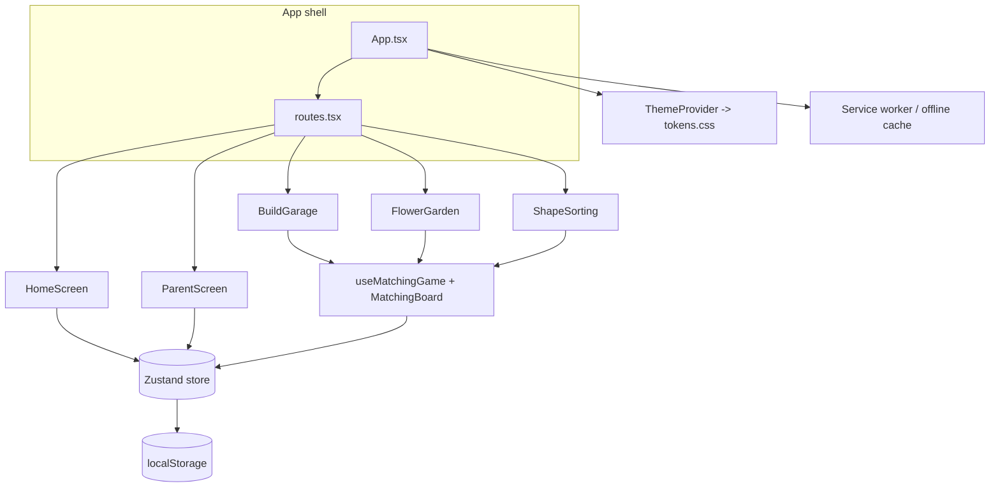

# Application Architecture

## Overview

Spielgarten is a **single-page, fully client-side Progressive Web App**. It is
built as a static bundle (HTML, CSS, JS, assets), runs entirely in the browser,
and is served in production by nginx inside a container. There is no backend.

The architecture has one organising goal beyond "work well today": keep game
**rules**, **presentation** and **browser APIs** separated, so the project can
later be wrapped as a native app (Capacitor / Expo / React Native / Tauri)
without rewriting the games.

## Tech stack

| Concern | Choice |
|---|---|
| UI framework | React 18 + TypeScript (strict) |
| Build tool | Vite 6 |
| Styling | Tailwind CSS 3 + CSS-variable design tokens |
| UI primitives | shadcn/ui-style components, Lucide icons |
| Animation | Framer Motion (used sparingly, gentle) |
| State | Zustand (+ `persist` to `localStorage`) |
| PWA | vite-plugin-pwa (injectManifest) + a hand-authored service worker |
| Runtime (container) | nginx (non-root, static file server) |

## Layered structure



## Directory layout

```
src/
  app/         App shell + the tiny store-driven router
  components/
    ui/        shadcn/ui-style primitives (Button)
    layout/    AppShell, GameScreen frames
    toddler/   Large toddler-facing components (tiles, round buttons, gate ...)
  games/
    shared/    Reusable matching engine (logic + board + draggable piece)
    build-garage/ flower-garden/ shape-sorting/   One folder per game
  screens/     HomeScreen, ParentScreen
  store/       Zustand store (app state + persistence)
  theme/       CSS-variable tokens + ThemeProvider
  pwa/         Manifest, service worker, registration
  i18n/        German strings
  lib/         Framework-agnostic helpers (utils, motion, platform)
```

Each game folder is self-contained: `data.ts` (content), `logic.ts` (rules),
`art.tsx` (modular inline SVG), and the screen component.

## Core: the matching-game engine

All three MVP games are the same kind of activity — match an item to a target —
so they share one engine in `src/games/shared/`:

- **`useMatchingGame`** — a *headless* hook. It owns the rules only: building a
  round, tracking placements, deciding correct vs. wrong, completion, reset. It
  has **no rendering and no browser APIs**, so it is trivially portable and
  testable.
- **`MatchingBoard`** — the presentation layer. It renders targets and the item
  tray, wires up drag-and-drop *and* tap-to-place, and shows gentle feedback.
- **`DraggablePiece`** — a single forgiving, touch-first interactive piece.

A new matching-style game therefore only needs data, artwork and a thin
`logic.ts` wrapper — see `CLAUDE.md` for the step-by-step.

## State management

A single Zustand store (`src/store/appStore.ts`) holds the current screen,
theme, accessibility flags and per-game progress. The `persist` middleware
saves the durable subset (everything except the current screen) to
`localStorage`. There is no other global state.

## Theming

`src/theme/tokens.css` defines every colour as an HSL-channel CSS variable, with
overrides for `.dark`, `.contrast-high` and `.dark.contrast-high`. Tailwind maps
those variables to utility classes. `ThemeProvider` is the only code that
touches the document root — it toggles the theme/contrast/reduced-motion
classes from the store.

## Navigation

Navigation is a tiny store-driven router rather than URL-based routing: the
store holds a `screen` id and `routes.tsx` maps ids to components. This keeps
toddlers from getting lost via browser history and matches how a future native
build would navigate.

## PWA & offline

`vite-plugin-pwa` (injectManifest strategy) builds the hand-authored service
worker in `src/pwa/service-worker.ts` and injects the precache list. The worker
precaches the app shell on install and serves assets cache-first, so the app is
fully usable offline after the first load. The manifest enables installation.

## Build & deployment

```
npm run build  ->  dist/   (tsc type-check + Vite build + service worker)
        |
        v
Dockerfile (multi-stage)  ->  nginx image  ->  Docker Hub  ->  any host
```

The build stage compiles the bundle; the runtime stage is a minimal non-root
nginx image serving `dist/`. See `docs/security.md` for hardening details.

## Path to native

- Game rules live in framework-light hooks with no DOM dependency.
- Every browser-only call (haptics, install detection) is isolated in
  `src/lib/platform.ts` — the single file a native target re-implements.
- Navigation is not URL-coupled.
- Artwork is inline SVG that travels with its components.
