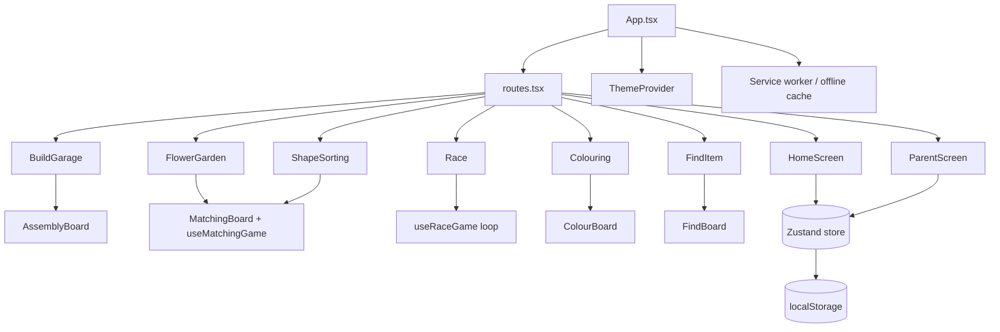

# Application Architecture

## Overview

Spielgarten is a **single-page, fully client-side Progressive Web App**. It is
built as a static bundle (HTML, CSS, JS, assets), runs entirely in the browser,
and is served in production by nginx inside a container. There is no backend.

The architecture keeps game **rules**, **presentation** and **browser APIs**
separated, so the project can later be wrapped as a native app
(Capacitor / Expo / React Native / Tauri) without rewriting the games.

## Tech stack

| Concern | Choice |
|---|---|
| UI framework | React 18 + TypeScript (strict) |
| Build tool | Vite 6 |
| Styling | Tailwind CSS 3 + CSS-variable design tokens |
| UI primitives | shadcn/ui-style components, Lucide icons |
| Animation | Framer Motion (used sparingly, gentle) |
| State | Zustand (+ `persist` to `localStorage`) |
| PWA | vite-plugin-pwa (injectManifest) + a hand-authored service worker |
| Runtime (container) | nginx (non-root, static file server) |

## The six games

| Game | Type | Mechanic |
|---|---|---|
| Build Garage | Assembly | Drag parts onto the vehicle; they snap into place. |
| Flower Garden | Matching | Match each flower to the pot of its colour. |
| Shape Sorting | Matching | Match each shape into its hole. |
| Race | Steering | Hold and move the car; dodge obstacles; collect ten to win. |
| Colouring | Colouring | Pick a colour; tap to fill a region, or sweep the brush to paint. |
| Find-an-item | Searching | Find the item shown in the frame among the others. |

Every game has a per-session **difficulty ramp**: it starts gentle, gets harder
the longer the child plays, and resets when they return to the home screen
(which simply unmounts the game component).

Shared systems live in `src/games/shared/`: `useMatchingGame` + `MatchingBoard`
(the headless matching engine and its board, used by Shape Sorting and Flower
Garden) and `DraggablePiece` (the forgiving drag/tap piece). Build Garage,
Race, Colouring and Find-an-item each have their own logic and board.



## Directory layout

```
src/
  app/          App shell + the tiny store-driven router
  components/
    ui/         shadcn/ui-style primitives (Button)
    layout/     AppShell, GameScreen frames
    toddler/    Large toddler-facing components (tiles, round buttons, gate)
  games/
    shared/     useMatchingGame, MatchingBoard, DraggablePiece
    build-garage/  Assembly game (data, logic, art, AssemblyBoard, screen)
    flower-garden/ Colour-matching game (data, logic, art, screen)
    shape-sorting/ Shape-matching game (data, logic, art, screen)
    race/          Steering game (data, logic loop, art, screen)
    colouring/     Colouring game (data, logic, art, ColourBoard, screen)
    find-item/     Find-an-item game (data, logic, art, FindBoard, screen)
  screens/      HomeScreen, ParentScreen
  store/        Zustand store (app state + persistence)
  theme/        CSS-variable tokens + ThemeProvider
  pwa/          Manifest, service worker, registration
  i18n/         German strings
  lib/          Framework-agnostic helpers (utils, motion, platform)
```

## Game logic

- **Build Garage**, **Flower Garden** and **Shape Sorting** logic is a headless
  hook (`useBuildGarage`, `useFlowerGarden`, `useMatchingGame`) holding only the
  rules - the round, placements, completion, the difficulty level. No DOM.
- **Race** runs a `requestAnimationFrame` loop in `useRaceGame`: it owns car
  position, items, speed and collisions in a ref, and publishes a render
  snapshot each frame. It is the one game with a real-time loop.
- Boards (`MatchingBoard`, `AssemblyBoard`, the Race field) own presentation -
  drag/tap, hit-testing, gentle feedback, completion.

## State management

A single Zustand store (`src/store/appStore.ts`) holds the current screen,
theme, accessibility flags and per-game progress. The `persist` middleware
saves the durable subset (everything except the current screen) to
`localStorage`, deep-merging so games added in later versions still get a
value. Difficulty level is **not** global state - it lives in each game and
resets on unmount.

## Theming

`src/theme/tokens.css` defines every colour as an HSL-channel CSS variable, with
overrides for `.dark`, `.contrast-high` and `.dark.contrast-high`. Tailwind maps
those variables to utility classes. `ThemeProvider` is the only code that
touches the document root.

## Navigation

A tiny store-driven router: the store holds a `screen` id and `routes.tsx` maps
ids to components. Leaving a game unmounts it - which is also how the
difficulty ramp resets.

## PWA & offline

`vite-plugin-pwa` (injectManifest) builds the hand-authored service worker in
`src/pwa/service-worker.ts` and injects the precache list. The worker precaches
the app shell on install and serves assets cache-first, so the app is fully
usable offline after the first load.

## Build & deployment

```
npm run build  ->  dist/   (tsc type-check + Vite build + service worker)
        |
        v
Dockerfile (multi-stage)  ->  nginx image  ->  Docker Hub  ->  any host
```

The build stage is pinned to the native build CPU so multi-arch images build
without QEMU; the runtime stage is a minimal non-root nginx serving `dist/`.
See `docs/security.md` for hardening details.

## Path to native

- Game rules live in framework-light hooks with no DOM dependency.
- Every browser-only call (haptics, install detection) is isolated in
  `src/lib/platform.ts` - the single file a native target re-implements.
- Navigation is not URL-coupled.
- Artwork is inline SVG that travels with its components.
